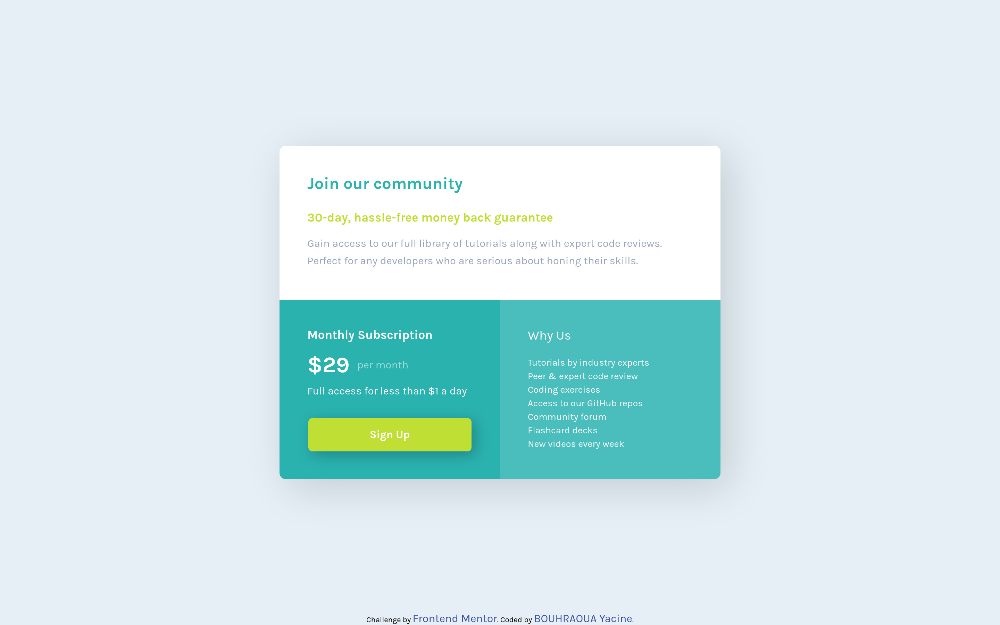
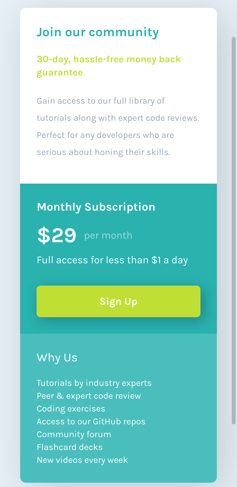

# Frontend Mentor - Profile card component solution

This is a solution to the [Profile card component challenge on Frontend Mentor](https://www.frontendmentor.io/challenges/profile-card-component-cfArpWshJ). Frontend Mentor challenges help you improve your coding skills by building realistic projects. 

## Table of contents

- [Frontend Mentor - Profile card component solution](#Frontend-Mentor---Profile-card-component-solution)
  - [Table of contents](#Table-of-contents)
  - [Overview](#Overview)
    - [The challenge](#The-challenge)
    - [Screenshot](#Screenshot)
    - [Links](#Links)
  - [My process](#My-process)
    - [Built with](#Built-with)
  - [Author](#Author)

## Overview

### The challenge

- Build out the project to the designs provided

### Screenshot

### Links

- Solution URL: [Solution](https://www.frontendmentor.io/solutions/responsive-single-price-grid-component-using-flexbox-pLoSwaBin)
- Live Site URL: [GitHub Pages](https://bouhraoua-yacine.github.io/single-price-grid-component/)

## My process

### Built with

- Semantic HTML5 markup
- CSS custom properties
- Flexbox
- Mobile-first workflow

## Author

- Frontend Mentor - [@yorline](https://www.frontendmentor.io/profile/yorline)

